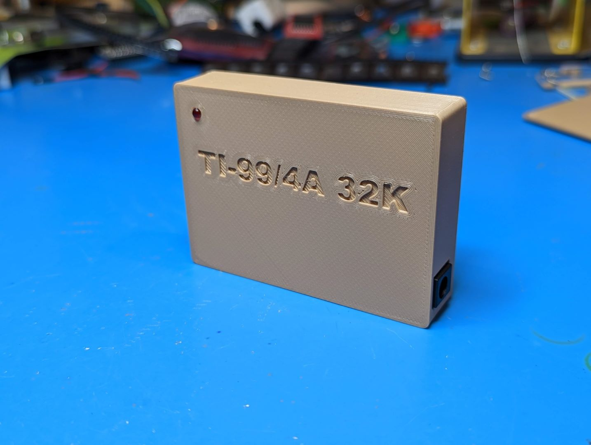
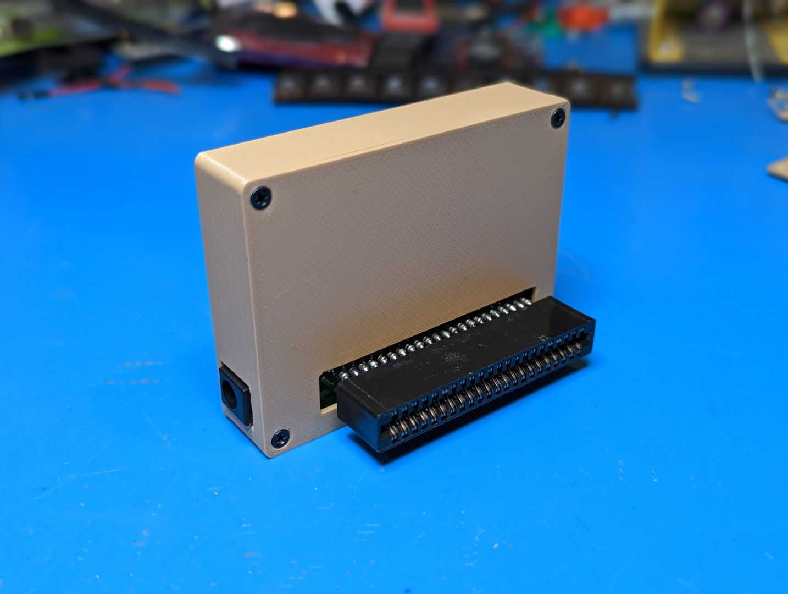
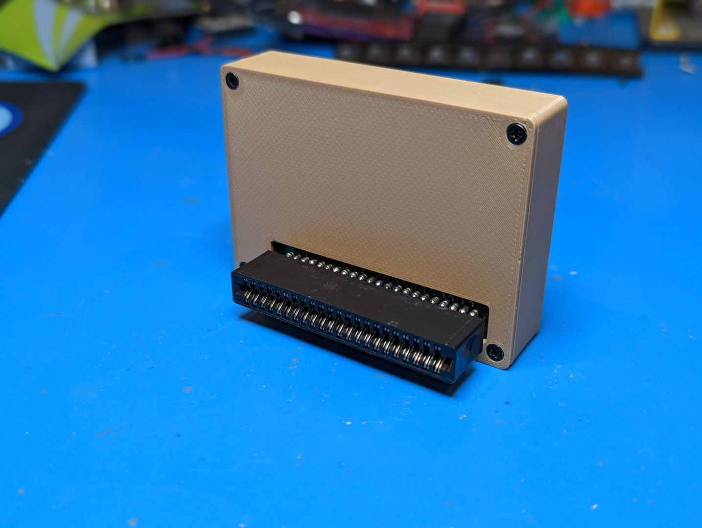
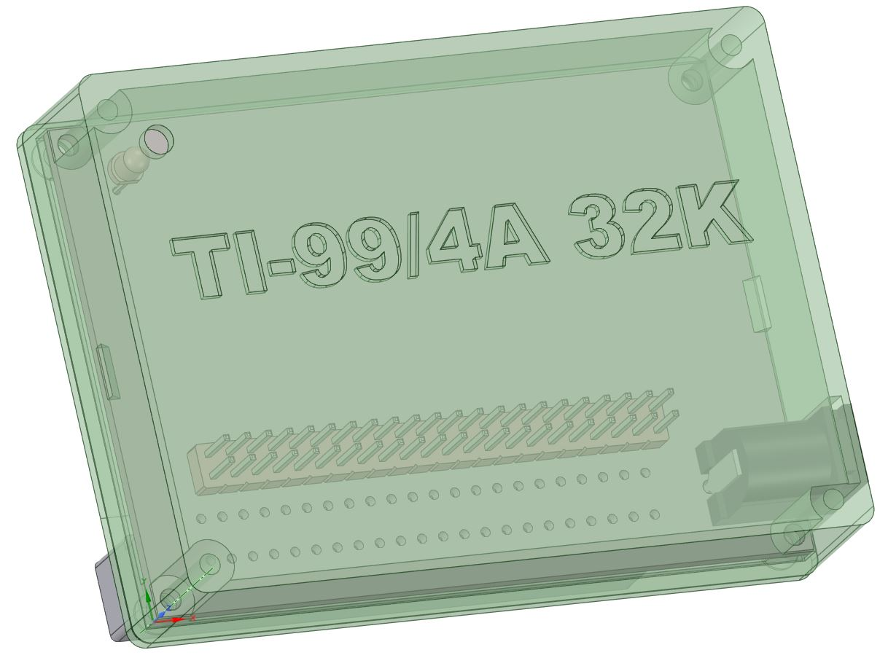
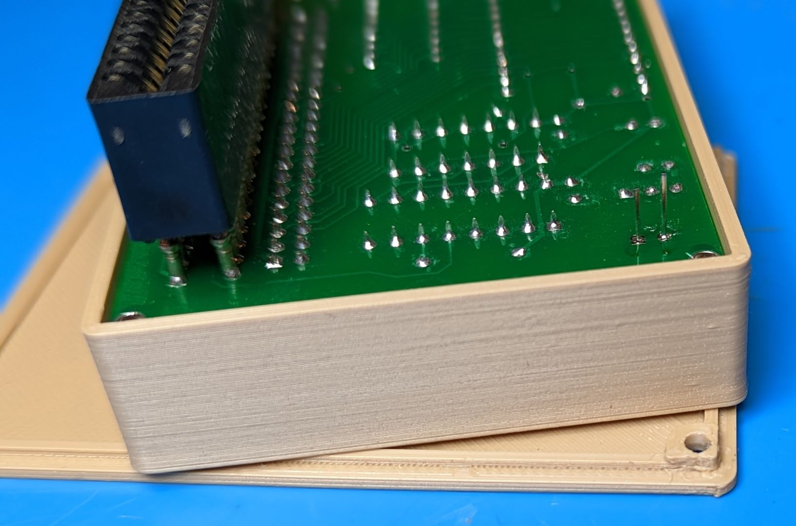

3D printable case for [Jedimatt42's Sideport 32K memory expansion for the TI-99/4A](https://jedimatt42.com/4a/ti32kmem/). I assembled mine with a generic 44p edge connector but the case opening should be big enough to also fit a TE/AMP or EDAC brand connector when I looked at their datasheets. The opening is intentionally offset to the upper left to provide enough clearance for the lower right coutersunk screw hole on the case back.

Designed with 0.2mm clearances, prints fine on an Ender 3 type printer in PLA with no need for supports. Assemble with four M2.5x10mm (or longer) screws.

The Kicad 6 board I created from the gerber files, the STEP file I exported and then modeled around, and the DesignSpark file are also available if you want to modify or improve my design.

One trick to get a nice 1mm reveal on your 3mm LED is to use the case lid to space the face away, drop the led down through the opening until it touches the lid, and then solder it.

Also available at [https://www.thingiverse.com/thing:5619356](https://www.thingiverse.com/thing:5619356)
